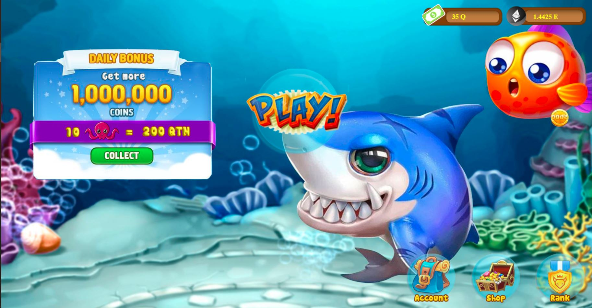
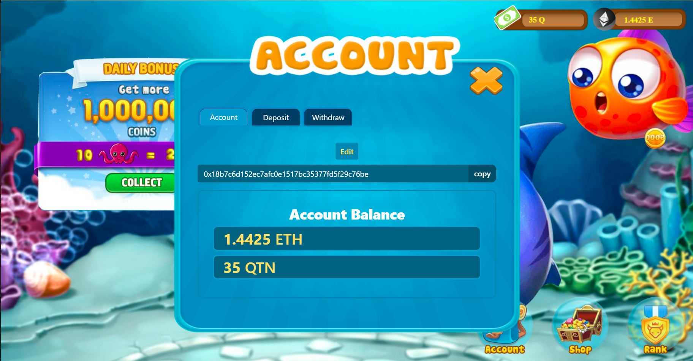
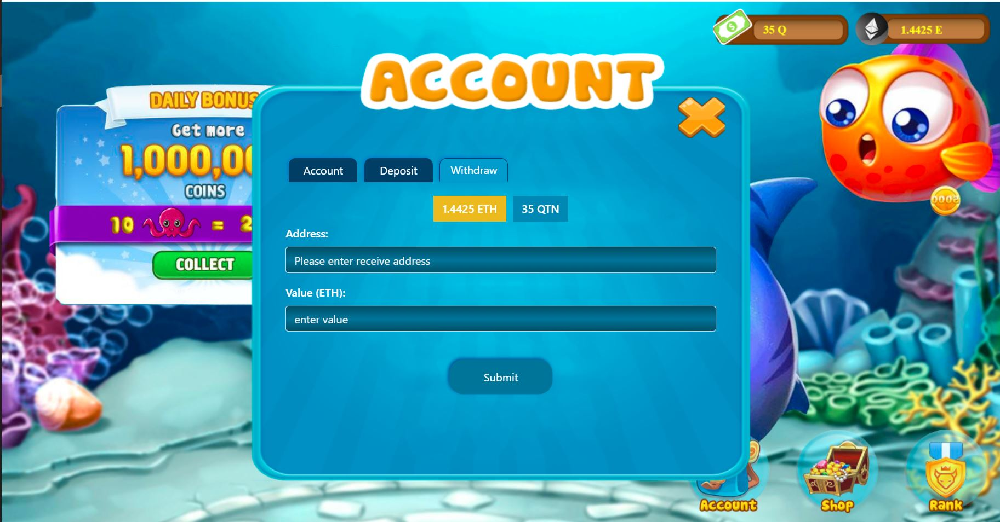
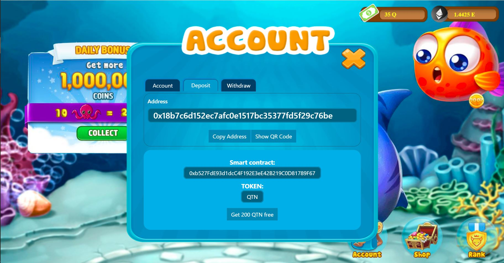
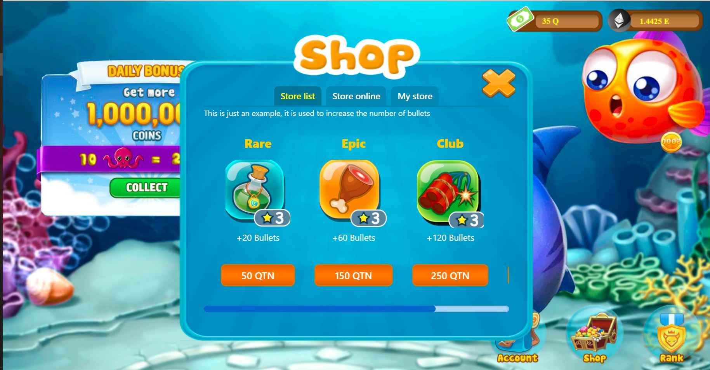
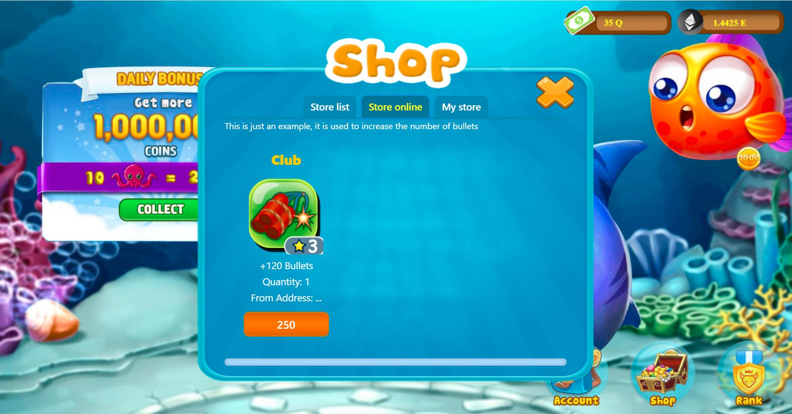
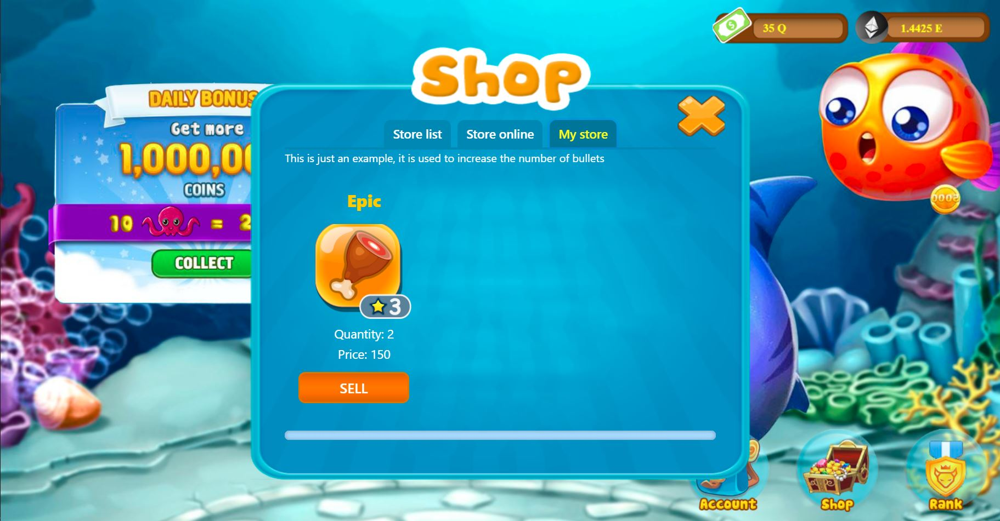
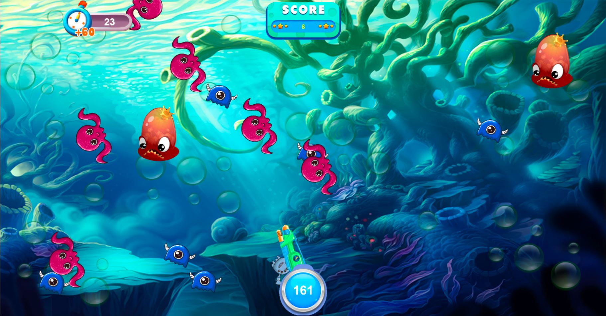
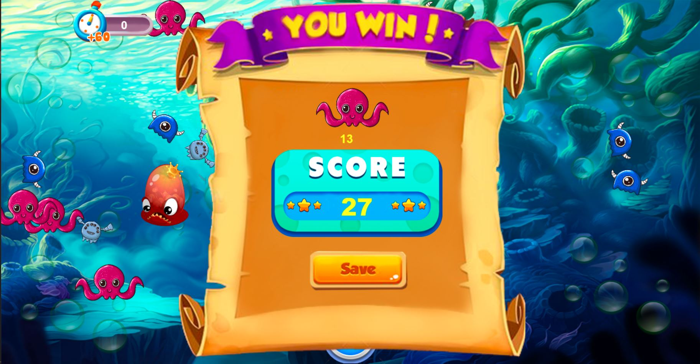

# Game Blockchain for Hackathon 2019

Participants will need to create a game in 07 days.

## Authors

* **Nguyễn Quốc Trường** - *working at Aris Viet Nam* - [Github](https://github.com/truong160196)

| | |
| ------ | ------ |
| Full Name| Nguyễn Quốc Trường|
| Company| Aris Viet Nam|
| Email| truong160196@gmail.com |

- follow project production: [game.laptrinhblockchain.net](http://game.laptrinhblockchain.net)

## Scope Game
- Sign in Metamask to start the game
- The game at least provides 03 activities of using Crypto (send/receive/buy/sell)
- Basic graphic

### Prerequisites
| Name | Description |
| ------ | ------ |
| Module Bundler | [Webpack](https://webpack.js.org/) |
| Library Framework | [ReactJS](https://reactjs.org/), [Redux](https://redux.js.org/) |
| Library Server | [Axios](https://github.com/axios/axios) |
| CSS Framework | [Bootstrap](https://getbootstrap.com/docs/3.4/) |
| CSS | [css framework to reference osaka code(SCSS: react-bootstrap)](https://react-bootstrap.github.io/getting-started/introduction/) |
| React Packages | [React-Hot-Loader](https://github.com/gaearon/react-hot-loader/), [React-Router-Dom](https://github.com/ReactTraining/react-router), [React-Bootstrap-Daterangepicker](https://github.com/skratchdot/react-bootstrap-daterangepicker/) |
| Blockchain Framework | [Web3.js](https://web3js.readthedocs.io/en/v1.2.4/getting-started.html#adding-web3)|
| Ethereum Framework| [ethereumjs-tx](https://github.com/ethereumjs/ethereumjs-tx)|
| Game Framework | [Pixi.js](https://github.com/pixijs/pixi.js)|

## Installing

### Install library

```
npm install
```

### Start project

```
npm start
```
Go to browser for now
```
http://localhost:3006
```
# Public game
game publish 
[link publish game](http://game.laptrinhblockchain.net/)

# Testnet

Using testnet [Ropsten](https://ropsten.etherscan.io/)

### extension browser require
You can install the MetaMask add-on in Chrome, Firefox, Opera, and the new Brave browser

download extension at [metamask.io](https://metamask.io/)
### Smart contract address

[0xb527FdE93d1dcC4F192E3eE42B219C0D81789F67](https://ropsten.etherscan.io/address/0xb527fde93d1dcc4f192e3ee42b219c0d81789f67)

#### funtion

- update account
- Reward
- add/update/view item for account
- transfer item
- transfer gift
- add/update/view/delete store
### Token using game
Token used to play the game;

[QTN](https://ropsten.etherscan.io/token/0xb527fde93d1dcc4f192e3ee42b219c0d81789f67)

### Token support
QTN, ETH

## Deployment

```
npm run build
```
path ./build
# Introduce game
- home screen

- Account management

- Withdraw management

- Deposit management

- Shop list management

- Shop online management

- Item management

- Game screen

- Victory screen

## License
Hackathon 2019
